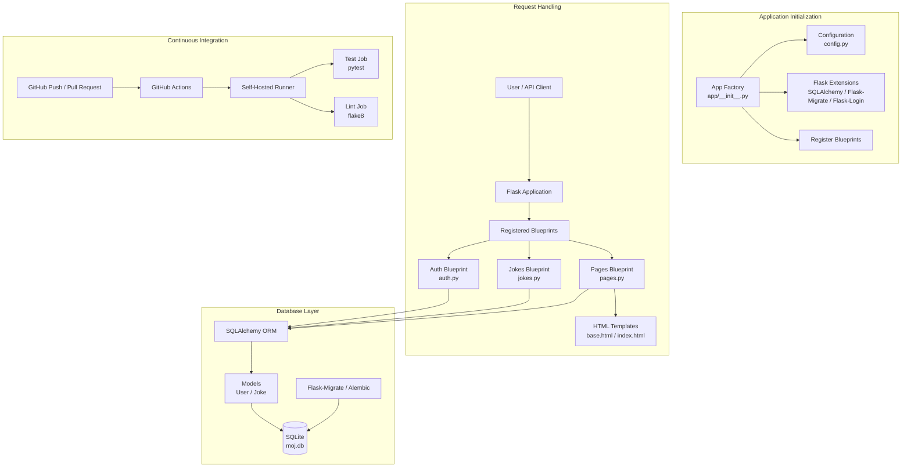

```mermaid
flowchart TD
    subgraph APP["Application Initialization"]
        A["App Factory<br/>app/__init__.py"]
        B["Configuration<br/>config.py"]
        C["Flask Extensions<br/>SQLAlchemy / Flask-Migrate / Flask-Login"]
        D["Register Blueprints"]
        A --> B
        A --> C
        A --> D
    end

    subgraph REQUESTS["Request Handling"]
        U["User / API Client"] --> F["Flask Application"]
        F --> E["Registered Blueprints"]
        E --> G["Auth Blueprint<br/>auth.py"]
        E --> H["Jokes Blueprint<br/>jokes.py"]
        E --> I["Pages Blueprint<br/>pages.py"]
        I --> J["HTML Templates<br/>base.html / index.html"]
    end

    G --> K["SQLAlchemy ORM"]
    H --> K
    I --> K

    subgraph DATABASE["Database Layer"]
        K --> L["Models<br/>User / Joke"]
        L --> M[("SQLite<br/>moj.db")]
        N["Flask-Migrate / Alembic"] --> M
    end

    subgraph CI["Continuous Integration"]
        O["GitHub Push / Pull Request"] --> P["GitHub Actions"]
        P --> Q["Self-Hosted Runner"]
        Q --> R["Test Job<br/>pytest"]
        Q --> S["Lint Job<br/>flake8"]
    end
```
