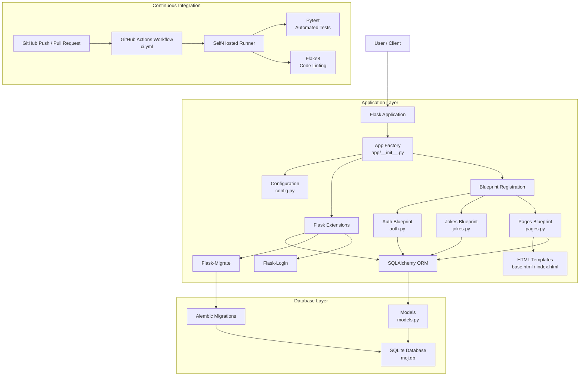

```mermaid
flowchart TD
    A["User / Client"] --> B["Flask Application"]

    subgraph APP["Application Layer"]
        B --> C["App Factory<br/>app/__init__.py"]
        C --> D["Configuration<br/>config.py"]
        C --> E["Flask Extensions"]
        C --> F["Blueprint Registration"]

        E --> G["SQLAlchemy ORM"]
        E --> H["Flask-Migrate"]
        E --> I["Flask-Login"]

        F --> J["Auth Blueprint<br/>auth.py"]
        F --> K["Jokes Blueprint<br/>jokes.py"]
        F --> L["Pages Blueprint<br/>pages.py"]
        
        L --> M["HTML Templates<br/>base.html / index.html"]
    end

    J --> G
    K --> G
    L --> G

    subgraph DATA["Database Layer"]
        G --> N["Models<br/>models.py"]
        N --> O["SQLite Database<br/>moj.db"]
        H --> P["Alembic Migrations"]
        P --> O
    end

    subgraph CI["Continuous Integration"]
        Q["GitHub Push / Pull Request"] --> R["GitHub Actions Workflow<br/>ci.yml"]
        R --> S["Self-Hosted Runner"]
        S --> T["Pytest<br/>Automated Tests"]
        S --> U["Flake8<br/>Code Linting"]
    end
```
