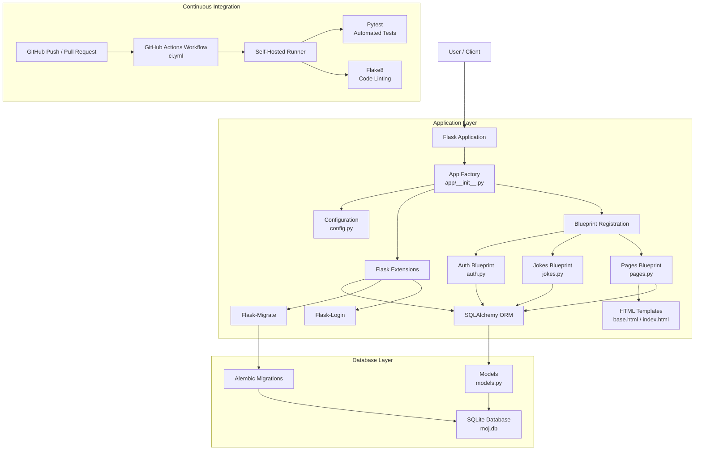
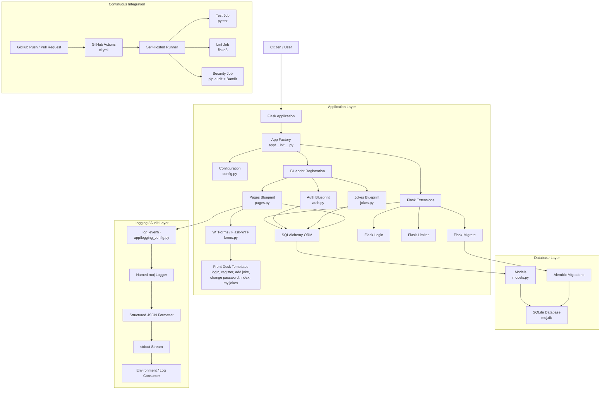

```mermaid
flowchart TD
    A["User / Client"] --> B["Flask Application"]

    subgraph APP["Application Layer"]
        B --> C["App Factory<br/>app/__init__.py"]
        C --> D["Configuration<br/>config.py"]
        C --> E["Flask Extensions"]
        C --> F["Blueprint Registration"]

        E --> G["SQLAlchemy ORM"]
        E --> H["Flask-Migrate"]
        E --> I["Flask-Login"]

        F --> J["Auth Blueprint<br/>auth.py"]
        F --> K["Jokes Blueprint<br/>jokes.py"]
        F --> L["Pages Blueprint<br/>pages.py"]
        
        L --> M["HTML Templates<br/>base.html / index.html"]
    end

    J --> G
    K --> G
    L --> G

    subgraph DATA["Database Layer"]
        G --> N["Models<br/>models.py"]
        N --> O["SQLite Database<br/>moj.db"]
        H --> P["Alembic Migrations"]
        P --> O
    end

    subgraph CI["Continuous Integration"]
        Q["GitHub Push / Pull Request"] --> R["GitHub Actions Workflow<br/>ci.yml"]
        R --> S["Self-Hosted Runner"]
        S --> T["Pytest<br/>Automated Tests"]
        S --> U["Flake8<br/>Code Linting"]
    end
```

#Next One

```mermaid
flowchart TD
    A["Citizen / User"] --> B["Flask Application"]

    subgraph APP["Application Layer"]
        B --> C["App Factory<br/>app/__init__.py"]
        C --> D["Configuration<br/>config.py"]
        C --> E["Flask Extensions"]
        C --> F["Blueprint Registration"]

        E --> G["SQLAlchemy ORM"]
        E --> H["Flask-Migrate"]
        E --> I["Flask-Login"]
        E --> J["Flask-Limiter"]

        F --> K["Auth Blueprint<br/>auth.py"]
        F --> L["Jokes Blueprint<br/>jokes.py"]
        F --> M["Pages Blueprint<br/>pages.py"]

        M --> N["WTForms / Flask-WTF<br/>forms.py"]
        N --> O["Front Desk Templates<br/>login, register, add joke,<br/>change password, index, my jokes"]
    end

    K --> G
    L --> G
    M --> G

    subgraph DATA["Database Layer"]
        G --> P["Models<br/>models.py"]
        P --> Q["SQLite Database<br/>moj.db"]
        H --> R["Alembic Migrations"]
        R --> Q
    end

    subgraph LOGGING["Logging / Audit Layer"]
        M --> S["log_event()<br/>app/logging_config.py"]
        S --> T["Named moj Logger"]
        T --> U["Structured JSON Formatter"]
        U --> V["stdout Stream"]
        V --> W["Environment / Log Consumer"]
    end

    subgraph CI["Continuous Integration"]
        X["GitHub Push / Pull Request"] --> Y["GitHub Actions<br/>ci.yml"]
        Y --> Z["Self-Hosted Runner"]

        Z --> AA["Test Job<br/>pytest"]
        Z --> AB["Lint Job<br/>flake8"]
        Z --> AC["Security Job<br/>pip-audit + Bandit"]
    end
```

