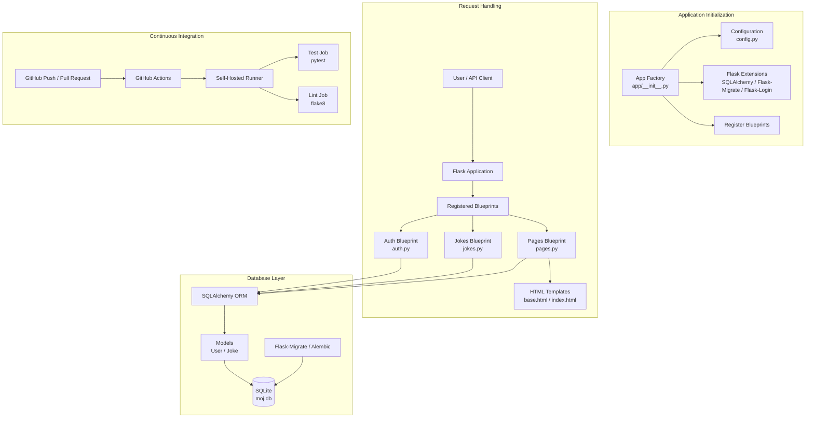
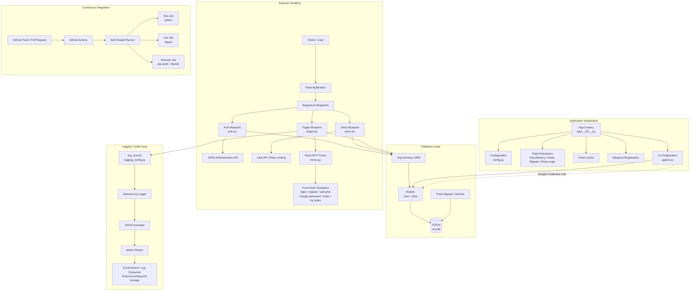

```mermaid
flowchart TD
    subgraph APP["Application Initialization"]
        A["App Factory<br/>app/__init__.py"]
        B["Configuration<br/>config.py"]
        C["Flask Extensions<br/>SQLAlchemy / Flask-Migrate / Flask-Login"]
        D["Register Blueprints"]
        A --> B
        A --> C
        A --> D
    end

    subgraph REQUESTS["Request Handling"]
        U["User / API Client"] --> F["Flask Application"]
        F --> E["Registered Blueprints"]
        E --> G["Auth Blueprint<br/>auth.py"]
        E --> H["Jokes Blueprint<br/>jokes.py"]
        E --> I["Pages Blueprint<br/>pages.py"]
        I --> J["HTML Templates<br/>base.html / index.html"]
    end

    G --> K["SQLAlchemy ORM"]
    H --> K
    I --> K

    subgraph DATABASE["Database Layer"]
        K --> L["Models<br/>User / Joke"]
        L --> M[("SQLite<br/>moj.db")]
        N["Flask-Migrate / Alembic"] --> M
    end

    subgraph CI["Continuous Integration"]
        O["GitHub Push / Pull Request"] --> P["GitHub Actions"]
        P --> Q["Self-Hosted Runner"]
        Q --> R["Test Job<br/>pytest"]
        Q --> S["Lint Job<br/>flake8"]
    end
```

```mermaid
flowchart TD
    subgraph APP["Application Initialization"]
        A["App Factory<br/>app/__init__.py"]
        B["Configuration<br/>config.py"]
        C["Flask Extensions<br/>SQLAlchemy / Flask-Migrate / Flask-Login"]
        D["Flask-Limiter"]
        E["Blueprint Registration"]
        F["CLI Registration<br/>app/cli.py"]
        A --> B
        A --> C
        A --> D
        A --> E
        A --> F
    end

    subgraph REQUESTS["Request Handling"]
        U["Citizen / User"] --> G["Flask Application"]
        G --> H["Registered Blueprints"]
        H --> I["Auth Blueprint<br/>auth.py"]
        H --> J["Jokes Blueprint<br/>jokes.py"]
        H --> K["Pages Blueprint<br/>pages.py"]

        I --> L["JSON Authentication API"]
        J --> M["Joke API / Rate Limiting"]
        K --> N["Flask-WTF Forms<br/>forms.py"]
        N --> O["Front Desk Templates<br/>login / register / add joke<br/>change password / index / my jokes"]
    end

    subgraph DATABASE["Database Layer"]
        I --> P["SQLAlchemy ORM"]
        J --> P
        K --> P
        P --> Q["Models<br/>User / Joke"]
        Q --> R[("SQLite<br/>moj.db")]
        S["Flask-Migrate / Alembic"] --> R
        F --> Q
        F -. "Assigns moderator role" .-> Q
    end

    subgraph LOGGING["Logging / Audit Layer"]
        K --> T["log_event()<br/>logging_config.py"]
        T --> V["Named moj Logger"]
        V --> W["JSON Formatter"]
        W --> X["stdout Stream"]
        X --> Y["Environment / Log Consumer<br/>External routing and storage"]
    end

    subgraph CI["Continuous Integration"]
        Z["GitHub Push / Pull Request"] --> AA["GitHub Actions"]
        AA --> AB["Self-Hosted Runner"]
        AB --> AC["Test Job<br/>pytest"]
        AB --> AD["Lint Job<br/>flake8"]
        AB --> AE["Security Job<br/>pip-audit + Bandit"]
    end
```
